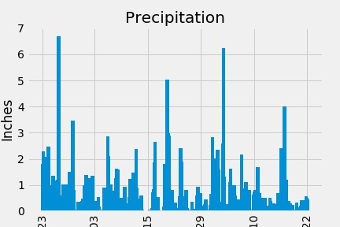
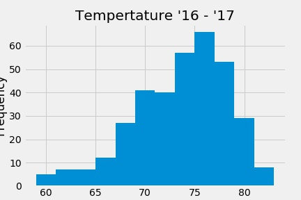
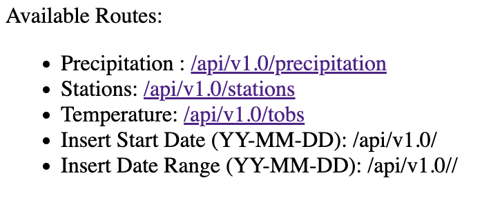

# sqlalchemy-challenge
sqlalchemy challenge is an exercise to practice using SQLAlchemy to interface with SQL databases using python.

To practice these skills, the script aims to collect climate data from Honolulu, Hawaii to determine temperature and precipitation trends over time. An API is also contructed using Flask to make this climate data available to the public.

### Analyze the Climate Data
---
In climate_analysis.ipynb tables are reflected from hawaii.sqlite. The precipitaiton data from the latest year in the data set is queried and plotted in precipitation_16_17.jpg.

All unique stations are listed along with the number of measurements they have made. The min, maximum, and average temperature are displayed from the most active station. All temperatures from that station are then displayed and plotted on a histogram.

### Climate App
---
app.py produces a local web app to provide an api for the data constructed in climate_analysis.ipynb. The web app was constructed using Flask. The web app has a homepage and five additional routes for: precipitation data, station information, temperature data, and temperature data from a start to latest date and a start to end point. 

---
Script was made for UCB Data Analytics Challenge 10

Author - Jacob Pohs

Some code provided by provided 'starter_code'